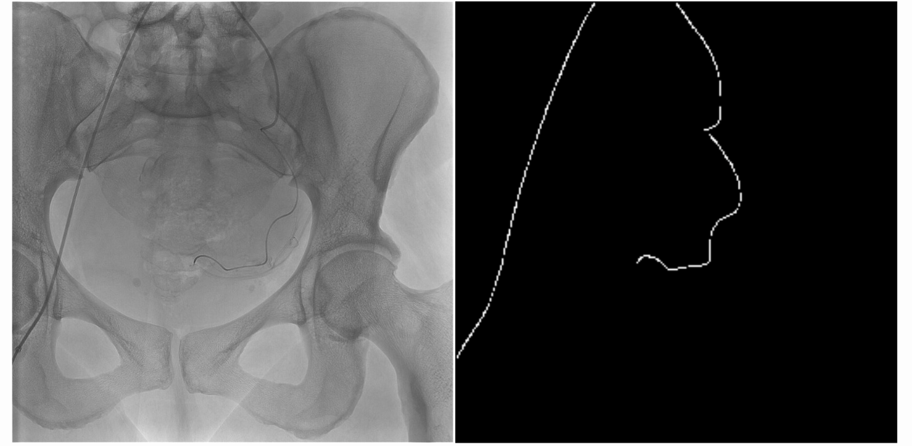

***
# Catheter Segmentation Project
*Collaboration with Dr Boeken* - 
*Lauvergne Clémentine, Picard Emilio*
***

This project aim to segment catheter in 2D Xray images, in order to segment them in real-time during interventionnal radiology.

## Approach
This repository contains source code to train SAM (pretrained in MedSam or either the normal one) to segment images.
This approach uses bounding box prompts during training, and can be adapt to point prompts during inference.

With a 0-shot approach during inference, SAM achieved a `mIOU of 0.57` and a `Dice metric of 0.72`. Previous work have seen mIOU arround 0.45, using U-Net architectures.

